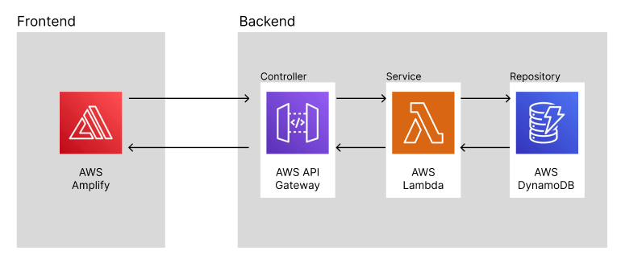

# Bank Code API Frontend

This is the frontend for the Bank Code API. It's part of a larger AWS project to gain exposure to different AWS services through hands-on experience. This frontend is a React application and is hosted on AWS Amplify.

## Why AWS Amplify?

The motivation for using AWS Amplify over Route 53 and S3 is primarily due to cost savings. Route 53 requires payment, whereas AWS Amplify offers a more cost-effective solution. Additionally, AWS Amplify provides an easy setup process, making it a convenient choice for hosting this application.

## Security Measures

As a security measure, the domain is whitelisted for CORS in the backend. This ensures that only calls from this frontend will be allowed, at least for the time being.

## Frontend Development

The frontend is developed lightly and is not currently responsive for mobile devices. It's a lightweight frontend designed to introduce a controlled entry point for calling the API. The frontend is expected to be used on a desktop.

## Future Developments

While there are currently no plans to make the frontend responsive for mobile devices, future developments might include this feature. However, at present, there is no use case for mobile usage.

## AWS Infrastructure

[Link to Design](https://www.figma.com/file/6mJuiHg02PaUauugLAe5jo/Untitled?type=design&node-id=0%3A1&mode=dev&t=MMf4z1UdkeQighjr-1)

## Frameworks and Language

[Link to Design](https://www.figma.com/file/6mJuiHg02PaUauugLAe5jo/Untitled?type=design&node-id=0%3A1&mode=dev&t=MMf4z1UdkeQighjr-1)